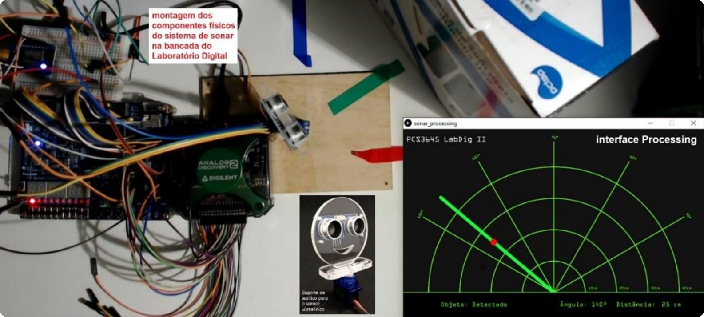

# 📡 VHDLSonar

Implementação em hardware (VHDL) de um sistema de sonar digital que realiza a varredura e detecção de objetos próximos usando um sensor ultrassônico de distância e um servomotor, e fornece saída serial para um dispositivo de apresentação. 

A montagem e testes foram realizados na placa de desenvolvimento FPGA DE0-CV, utilizando a infraestrutura disponível no Laboratório Digital da Universidade de São Paulo. O Relatório final pode ser encontrado [nesse aquivo](./Relatório%20&%20Documentação.pdf).

## Descrição do Projeto

Sistemas digitais de detecção de objetos a distância desempenham um papel fundamental em várias aplicações, como radares, lidar e sonar. Este projeto concentra-se em um sistema de sonar, que utiliza ondas acústicas de alta frequência para medir a distância aos objetos próximos.

O componente central deste sistema é o sensor de distância HC-SR04, que emite pulsos ultrassônicos a uma frequência de 40kHz. O sensor mede o tempo que os pulsos levam para viajar até um objeto e retornar, permitindo a determinação da distância até o objeto.

O sistema de sonar também inclui um servomotor, que é responsável por posicionar o sensor de distância. O servomotor permite variação angular dentro dos limites especificados, o que possibilita a varredura e localização de objetos em diferentes direções.

## Interface do Sistema de Sonar

A interface básica do sistema de sonar é composta pelos seguintes elementos:

O sensor HC-SR04 é montado no servomotor, que pode girar para varrer uma área específica. Em cada posição angular, o sistema mede a distância ao objeto mais próximo. Essa informação é então enviada pela interface serial para um dispositivo de apresentação, geralmente um computador - neste repositório fornecemos um arquivo processing para a visualização facilitada da saída do sistema.

## Montagem Física

A montagem física do sistema de sonar envolve a fixação do sensor HC-SR04 no servomotor, permitindo que ele gire em relação ao seu eixo. A figura a seguir ilustra uma possível montagem:

Esta montagem física permite a varredura eficiente da área e a medição da distância a objetos próximos em várias direções.

## Utilização

Para implementar este projeto, você precisará de:

1. Placa de desenvolvimento FPGA DE0-CV.
2. Sensor de distância HC-SR04.
3. Servomotor.
4. Conexão serial com um dispositivo de apresentação (como um computador).

Certifique-se de seguir as instruções de montagem e configuração apropriadas para o seu ambiente.
